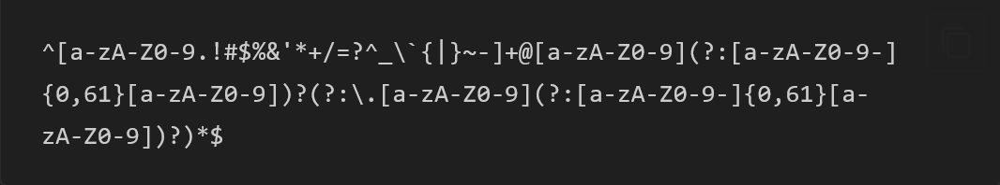
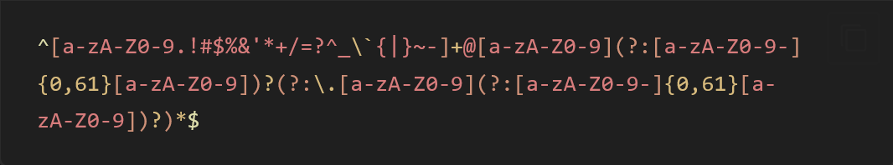

# regex-syntax

Grammar files for syntax highlight of regex. The grammar files are automatically generated from [Linguist](https://github.com/github-linguist/linguist/)'s regex grammars.

> [!NOTE]
> You may also be interested in [shell-session-syntax](https://github.com/Robot-Inventor/shell-session-syntax/) for syntax highlight of shell sessions.

|Before|After|
|:---:|:---:|
|||

## Usage

To use regex-syntax in [Shiki.js](https://shiki.style/), please download ``./syntaxes/regex.tmLanguage.json`` and load it as a custom language grammar. Language name is ``regex`` and ``regexp``.

```javascript
import { getHighlighter } from "shiki";
import regex from "./regex.tmLanguage.json" assert { type: "json" };

const code = `
^[a-zA-Z0-9.!#$%&'*+/=?^_\`{|}~-]+@[a-zA-Z0-9](?:[a-zA-Z0-9-]{0,61}[a-zA-Z0-9])?(?:\.[a-zA-Z0-9](?:[a-zA-Z0-9-]{0,61}[a-zA-Z0-9])?)*$
`.trim();

const highlighter = await getHighlighter({
    langs: [regex],
    themes: ["vitesse-dark"]
});

const html = highlighter.codeToHtml(code, {
    lang: "regex",
    theme: "vitesse-dark"
});

console.log(html);
```

Also, you can install regex-syntax via npm. (Note that the package name is ``regex-grammar`` not ``regex-syntax``)

```bash
npm install regex-grammar
```

```javascript
import { getHighlighter } from "shiki";
import regex from "regex-grammar";
// You can also import JSON file directly
// import regex from "regex-grammar/syntaxes/regex.tmLanguage.json" assert { type: "json" };

const code = `
^[a-zA-Z0-9.!#$%&'*+/=?^_\`{|}~-]+@[a-zA-Z0-9](?:[a-zA-Z0-9-]{0,61}[a-zA-Z0-9])?(?:\.[a-zA-Z0-9](?:[a-zA-Z0-9-]{0,61}[a-zA-Z0-9])?)*$
`.trim();

const highlighter = await getHighlighter({
    langs: [regex],
    themes: ["vitesse-dark"]
});

const html = highlighter.codeToHtml(code, {
    lang: "regex",
    theme: "vitesse-dark"
});

console.log(html);
```

## Update Grammar

To update the grammar file, run the following command. It automatically downloads the latest upstream grammar files and applies patches.

```bash
npm run build
```

## Grammar Sources

regex-syntax is generated by automatically applying patches to the following grammar file.

- [Linguist](https://github.com/github-linguist/linguist/) ([MIT License](https://github.com/github-linguist/linguist/blob/master/LICENSE))
